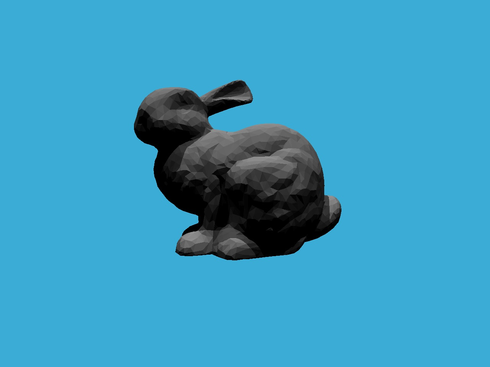
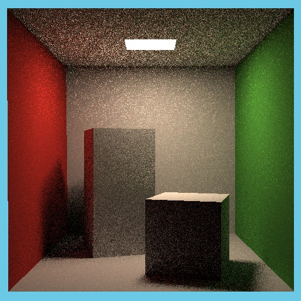

# GAMES 101 CG Introduction Assignments

## Course Information

**Course Name:** GAMES 101 Computer Graphics Introduction

**Instructor:** Prof. [Lingqi Yan](https://sites.cs.ucsb.edu/~lingqi/#), UCSB

Course Videos: [https://www.bilibili.com/video/BV1X7411F744?p=1](https://www.bilibili.com/video/BV1X7411F744?p=1)  
Course Details: [https://sites.cs.ucsb.edu/~lingqi/teaching/games101.html](https://sites.cs.ucsb.edu/~lingqi/teaching/games101.html)  
Course BBS: [http://games-cn.org/forums/forum/graphics-intro/](http://games-cn.org/forums/forum/graphics-intro/)  

The course aims to provide foundation of computer graphics while introducing real-world implementations. Topics covered include 2D and 3D transformations, Rasterization based interactive 3D graphics, shading and reflectance models, texture mapping, geometric modeling using Bézier and B-Spline curves, ray tracing, and animation. There will be an emphasis on both the mathematical and geometric aspects of graphics, as well as the ability to write fully functional 3D graphics programs.

## Assignment Descriptions

All detailed requirements are included in the PDF under each folder.
All output images are generated in folders named 'images'.

### Assigment 5 - Intersection with Triangles  
  
### Assigment 6 - Acceleration Using BVH (Bounding Volume Hierarchy)  
  
### Assigment 7 - Simulation of Path Tracing  
  
